# Null Sink Plugin - PipeWire Core Interface Call Sequence

This document shows the complete sequence of interface calls from PipeWire core to the null sink plugin, demonstrating the SPA plugin lifecycle and real-time processing flow.

## Complete Interface Call Sequence

```mermaid
sequenceDiagram
    participant PW as PipeWire Core
    participant Factory as spa_null_sink_factory
    participant Handle as spa_handle
    participant Node as spa_node (null_state)
    participant RT as Real-Time Thread

    Note over PW,RT: Phase 1: Plugin Discovery & Factory Registration

    PW->>Factory: spa_handle_factory_enum(&factory, &index=0)
    Factory-->>PW: return 1, factory=spa_null_sink_factory

    PW->>Factory: spa_handle_factory_enum(&factory, &index=1)
    Factory-->>PW: return 0 (no more factories)

    Note over PW: PipeWire registers spa_null_sink_factory

    Note over PW,RT: Phase 2: Handle Creation & Initialization

    PW->>Factory: factory->get_size(factory, info)
    Factory-->>PW: return sizeof(struct null_state)

    Note over PW: PipeWire allocates memory for null_state

    PW->>Factory: factory->init(factory, handle, info, support[], n_support)
    Factory->>Handle: null_state_init(state, log, system, loop)
    Note right of Handle: - Initialize spa_node interface<br/>- Set up hook list<br/>- Configure default node info<br/>- Set up port info
    Factory-->>PW: return 0 (success)

    Note over PW,RT: Phase 3: Interface Retrieval & Configuration

    PW->>Factory: factory->get_interface(handle, "Node", &interface)
    Factory->>Handle: Extract embedded spa_node from null_state
    Factory-->>PW: return 0, interface=&state->node

    Note over PW: PipeWire now has spa_node interface pointer

    Note over PW,RT: Phase 4: Event Listener Registration

    PW->>Node: impl_node_add_listener(node, &listener, &events, data)
    Note right of Node: Register PipeWire core as event listener<br/>for node state changes, param changes, etc.
    Node->>Node: spa_hook_list_append(&state->hooks, listener, events, data)
    Node-->>PW: return 0

    Note over PW,RT: Phase 5: I/O Area Assignment

    PW->>Node: impl_node_set_io(node, SPA_IO_Buffers, io_buffers, size)
    Note right of Node: Assign buffer I/O area for<br/>real-time communication
    Node->>Node: state->io = io_buffers
    Node-->>PW: return 0

    PW->>Node: impl_node_set_io(node, SPA_IO_RateMatch, rate_match, size)
    Node->>Node: state->rate_match = rate_match
    Node-->>PW: return 0

    Note over PW,RT: Phase 6: Format Negotiation

    PW->>Node: impl_node_enum_params(node, seq=1, SPA_PARAM_Format, start=0, num=1, filter)
    Node->>Node: Build supported format parameter:<br/>spa_format_audio_raw_build()
    Node->>Node: spa_node_call(&state->hooks, result, seq, SPA_RESULT_TYPE_NODE_PARAMS, &result)
    Node-->>PW: return 1 (format enumerated)

    Note over PW: PipeWire selects compatible format

    PW->>Node: impl_node_set_param(node, SPA_PARAM_Format, 0, format_param)
    Node->>Node: spa_format_parse(param, &info.media_type, &info.media_subtype)
    Node->>Node: spa_format_audio_raw_parse(param, &info.info.raw)
    Note right of Node: Validate format:<br/>- Check channels (1-64)<br/>- Check sample rate (<= 192kHz)<br/>- Store in state->current_format
    Node->>Node: state->have_format = true
    Node->>Node: spa_node_call(&state->hooks, param_changed, 0, SPA_PARAM_Format, param)
    Node-->>PW: return 0

    Note over PW,RT: Phase 7: Port Configuration

    PW->>Node: impl_node_enum_ports(node, seq=2, SPA_DIRECTION_INPUT, start=0, num=1)
    Node->>Node: spa_node_call(&state->hooks, result, seq, SPA_RESULT_TYPE_NODE_PORTS, &result)
    Node-->>PW: return 1 (port 0 enumerated)

    PW->>Node: impl_node_get_port_info(node, SPA_DIRECTION_INPUT, port_id=0, &port_info)
    Node-->>PW: return 0, port_info=&state->port_info

    Note over PW,RT: Phase 8: Buffer Assignment

    PW->>Node: impl_node_use_buffers(node, SPA_DIRECTION_INPUT, port_id=0, flags, buffers[], n_buffers)
    Note right of Node: Accept buffer assignment<br/>(null sink doesn't store references)
    Node-->>PW: return 0

    Note over PW,RT: Phase 9: Node Startup

    PW->>Node: impl_node_send_command(node, SPA_NODE_COMMAND_Start)
    Node->>Node: Validate state->have_format == true
    Node->>Node: state->started = true
    Note right of Node: spa_log_info("null-sink started")
    Node-->>PW: return 0

    Note over PW,RT: Phase 10: Real-Time Processing Loop

    loop Every Audio Quantum (e.g., 1024 samples @ 48kHz = ~21ms)
        RT->>Node: impl_node_process(node)

        Node->>Node: Check state->started && state->have_format
        alt Node Ready
            Node->>Node: io = state->io
            Node->>Node: Check io->buffer_id != SPA_ID_INVALID

            alt Buffer Available
                Node->>Node: buf = io->buffers[io->buffer_id]
                Note right of Node: CRITICAL REAL-TIME SECTION:<br/>- Extract buffer metadata<br/>- Calculate frames processed<br/>- Update statistics<br/>- NO BLOCKING OPERATIONS!

                Node->>Node: Extract size from buf->datas[0].chunk->size
                Node->>Node: frames = size / (channels * sizeof(float))
                Node->>Node: state->frame_count += frames
                Node->>Node: state->buffer_count++

                Note right of Node: NULL SINK OPERATION:<br/>Drop buffer instead of sending to hardware

                Node->>Node: io->buffer_id = SPA_ID_INVALID
                Note right of Node: Mark buffer as consumed<br/>(ready for recycling)

                Node-->>RT: return SPA_STATUS_OK
            else No Buffer
                Node-->>RT: return SPA_STATUS_OK
            end
        else Node Not Ready
            Node-->>RT: return SPA_STATUS_OK
        end
    end

    Note over PW,RT: Phase 11: Parameter Changes (Asynchronous)

    Note over PW: Format change requested
    PW->>Node: impl_node_set_param(node, SPA_PARAM_Format, 0, new_format)
    Node->>Node: Parse and validate new format
    Node->>Node: state->current_format = new_info
    Node->>Node: spa_node_call(&state->hooks, param_changed, 0, SPA_PARAM_Format, new_format)
    Node-->>PW: return 0

    Note over PW,RT: Phase 12: Node Control Commands

    Note over PW: Suspend/Pause requested
    PW->>Node: impl_node_send_command(node, SPA_NODE_COMMAND_Suspend)
    Node->>Node: state->started = false
    Note right of Node: spa_log_info("null-sink suspended")
    Node-->>PW: return 0

    Note over PW: Restart requested
    PW->>Node: impl_node_send_command(node, SPA_NODE_COMMAND_Start)
    Node->>Node: state->started = true
    Node-->>PW: return 0

    Note over PW,RT: Phase 13: Node Shutdown & Cleanup

    PW->>Node: impl_node_send_command(node, SPA_NODE_COMMAND_Suspend)
    Node->>Node: state->started = false
    Node-->>PW: return 0

    Note over PW: Remove I/O areas
    PW->>Node: impl_node_set_io(node, SPA_IO_Buffers, NULL, 0)
    Node->>Node: state->io = NULL
    Node-->>PW: return 0

    Note over PW: Clear format
    PW->>Node: impl_node_set_param(node, SPA_PARAM_Format, 0, NULL)
    Node->>Node: state->have_format = false
    Node->>Node: spa_zero(state->current_format)
    Node-->>PW: return 0

    Note over PW,RT: Phase 14: Handle Destruction

    PW->>Factory: factory->clear(handle)
    Factory->>Handle: null_state_cleanup(state)
    Note right of Handle: - Remove all event hooks<br/>- Reset state flags<br/>- Log cleanup message
    Factory-->>PW: return 0

    Note over PW: PipeWire deallocates memory
```



## Key Interface Method Categories

### 1. Factory Interface (`spa_handle_factory`)
```c
spa_handle_factory_enum()     // Plugin discovery
get_size()                    // Memory allocation size
init()                        // Handle initialization
clear()                       // Handle cleanup
get_interface()               // Interface retrieval
enum_interface_info()         // Interface capability discovery
```

### 2. Node Interface (`spa_node_methods`)
```c
// Lifecycle Management
add_listener()                // Event registration
send_command()                // Start/Stop/Suspend commands

// Configuration
set_param()                   // Format and property setting
enum_params()                 // Capability enumeration
set_io()                      // I/O area assignment

// Port Management
enum_ports()                  // Port discovery
get_port_info()               // Port information
port_set_param()              // Port-specific parameters
port_use_buffers()            // Buffer assignment
port_set_io()                 // Port I/O areas

// Real-Time Processing
process()                     // Audio processing (CRITICAL PATH)
```

### 3. Event Callbacks (`spa_node_events`)
```c
// Called by null sink to notify PipeWire core:
info()                        // Node information changed
param_changed()               // Parameter modified
result()                      // Async operation result
```

## Critical Real-Time Constraints

The `impl_node_process()` method has strict requirements:

⚡ **Real-Time Safe Operations:**
- ✅ Atomic memory access
- ✅ Lock-free buffer operations
- ✅ Simple arithmetic calculations
- ✅ Conditional branches
- ✅ Array indexing

🚫 **Forbidden in Real-Time Context:**
- ❌ Memory allocation (`malloc`, `free`)
- ❌ System calls (`read`, `write`, `ioctl`)
- ❌ Blocking operations (`mutex`, `semaphore`)
- ❌ Complex algorithms
- ❌ Logging (except trace level)

## Null Sink Specific Behavior

**Buffer Processing:**
1. Accept buffer from PipeWire graph
2. Extract metadata (size, frame count)
3. Update statistics (frames processed, buffer count)
4. **Drop audio data** (null operation)
5. Mark buffer as consumed
6. Return `SPA_STATUS_OK`

**Comparison with Real Sink:**
- **Real Audio Sink**: Would copy buffer data to hardware/file
- **Null Sink**: Immediately discards buffer data
- **Both**: Follow identical interface patterns and lifecycle

This sequence demonstrates the complete SPA plugin architecture from discovery through real-time processing, showing how PipeWire core orchestrates the entire audio processing pipeline through well-defined interface contracts.