# Null Sink Plugin - PipeWire Core Interface Call Sequence

This document shows the complete sequence of interface calls from PipeWire core to the null sink plugin, demonstrating the SPA plugin lifecycle and real-time processing flow.

## Complete Interface Call Sequence

```mermaid
sequenceDiagram
    participant PW as PipeWire Core
    participant Factory as spa_null_sink_factory
    participant Handle as spa_handle
    participant Node as spa_node (null_state)
    participant RT as Real-Time Thread

    Note over PW,RT: Phase 1: Plugin Discovery & Factory Registration

    PW->>Factory: spa_handle_factory_enum(&factory, &index=0)
    Factory-->>PW: return 1, factory=spa_null_sink_factory

    PW->>Factory: spa_handle_factory_enum(&factory, &index=1)
    Factory-->>PW: return 0 (no more factories)

    Note over PW: PipeWire registers spa_null_sink_factory

    Note over PW,RT: Phase 2: Handle Creation & Initialization

    PW->>Factory: factory->get_size(factory, info)
    Factory-->>PW: return sizeof(struct null_state)

    Note over PW: PipeWire allocates memory for null_state

    PW->>Factory: factory->init(factory, handle, info, support[], n_support)
    Factory->>Handle: null_state_init(state, log, system, loop)
    Note right of Handle: - Initialize spa_node interface<br/>- Set up hook list<br/>- Configure default node info<br/>- Set up port info
    Factory-->>PW: return 0 (success)

    Note over PW,RT: Phase 3: Interface Retrieval & Configuration

    PW->>Factory: factory->get_interface(handle, "Node", &interface)
    Factory->>Handle: Extract embedded spa_node from null_state
    Factory-->>PW: return 0, interface=&state->node

    Note over PW: PipeWire now has spa_node interface pointer

    Note over PW,RT: Phase 4: Event Listener Registration

    PW->>Node: impl_node_add_listener(node, &listener, &events, data)
    Note right of Node: Register PipeWire core as event listener<br/>for node state changes, param changes, etc.
    Node->>Node: spa_hook_list_append(&state->hooks, listener, events, data)
    Node-->>PW: return 0

    Note over PW,RT: Phase 5: I/O Area Assignment

    PW->>Node: impl_node_set_io(node, SPA_IO_Buffers, io_buffers, size)
    Note right of Node: Assign buffer I/O area for<br/>real-time communication
    Node->>Node: state->io = io_buffers
    Node-->>PW: return 0

    PW->>Node: impl_node_set_io(node, SPA_IO_RateMatch, rate_match, size)
    Node->>Node: state->rate_match = rate_match
    Node-->>PW: return 0

    Note over PW,RT: Phase 6: Format Negotiation

    PW->>Node: impl_node_enum_params(node, seq=1, SPA_PARAM_Format, start=0, num=1, filter)
    Node->>Node: Build supported format parameter:<br/>spa_format_audio_raw_build()
    Node->>Node: spa_node_call(&state->hooks, result, seq, SPA_RESULT_TYPE_NODE_PARAMS, &result)
    Node-->>PW: return 1 (format enumerated)

    Note over PW: PipeWire selects compatible format

    PW->>Node: impl_node_set_param(node, SPA_PARAM_Format, 0, format_param)
    Node->>Node: spa_format_parse(param, &info.media_type, &info.media_subtype)
    Node->>Node: spa_format_audio_raw_parse(param, &info.info.raw)
    Note right of Node: Validate format:<br/>- Check channels (1-64)<br/>- Check sample rate (<= 192kHz)<br/>- Store in state->current_format
    Node->>Node: state->have_format = true
    Node->>Node: spa_node_call(&state->hooks, param_changed, 0, SPA_PARAM_Format, param)
    Node-->>PW: return 0

    Note over PW,RT: Phase 7: Port Configuration

    PW->>Node: impl_node_enum_ports(node, seq=2, SPA_DIRECTION_INPUT, start=0, num=1)
    Node->>Node: spa_node_call(&state->hooks, result, seq, SPA_RESULT_TYPE_NODE_PORTS, &result)
    Node-->>PW: return 1 (port 0 enumerated)

    PW->>Node: impl_node_get_port_info(node, SPA_DIRECTION_INPUT, port_id=0, &port_info)
    Node-->>PW: return 0, port_info=&state->port_info

    Note over PW,RT: Phase 8: Buffer Assignment

    PW->>Node: impl_node_use_buffers(node, SPA_DIRECTION_INPUT, port_id=0, flags, buffers[], n_buffers)
    Note right of Node: Accept buffer assignment<br/>(null sink doesn't store references)
    Node-->>PW: return 0

    Note over PW,RT: Phase 9: Node Startup

    PW->>Node: impl_node_send_command(node, SPA_NODE_COMMAND_Start)
    Node->>Node: Validate state->have_format == true
    Node->>Node: state->started = true
    Note right of Node: spa_log_info("null-sink started")
    Node-->>PW: return 0

    Note over PW,RT: Phase 10: Real-Time Processing Loop

    loop Every Audio Quantum (e.g., 1024 samples @ 48kHz = ~21ms)
        RT->>Node: impl_node_process(node)

        Node->>Node: Check state->started && state->have_format
        alt Node Ready
            Node->>Node: io = state->io
            Node->>Node: Check io->buffer_id != SPA_ID_INVALID

            alt Buffer Available
                Node->>Node: buf = io->buffers[io->buffer_id]
                Note right of Node: CRITICAL REAL-TIME SECTION:<br/>- Extract buffer metadata<br/>- Calculate frames processed<br/>- Update statistics<br/>- NO BLOCKING OPERATIONS!

                Node->>Node: Extract size from buf->datas[0].chunk->size
                Node->>Node: frames = size / (channels * sizeof(float))
                Node->>Node: state->frame_count += frames
                Node->>Node: state->buffer_count++

                Note right of Node: NULL SINK OPERATION:<br/>Drop buffer instead of sending to hardware

                Node->>Node: io->buffer_id = SPA_ID_INVALID
                Note right of Node: Mark buffer as consumed<br/>(ready for recycling)

                Node-->>RT: return SPA_STATUS_OK
            else No Buffer
                Node-->>RT: return SPA_STATUS_OK
            end
        else Node Not Ready
            Node-->>RT: return SPA_STATUS_OK
        end
    end

    Note over PW,RT: Phase 11: Parameter Changes (Asynchronous)

    Note over PW: Format change requested
    PW->>Node: impl_node_set_param(node, SPA_PARAM_Format, 0, new_format)
    Node->>Node: Parse and validate new format
    Node->>Node: state->current_format = new_info
    Node->>Node: spa_node_call(&state->hooks, param_changed, 0, SPA_PARAM_Format, new_format)
    Node-->>PW: return 0

    Note over PW,RT: Phase 12: Node Control Commands

    Note over PW: Suspend/Pause requested
    PW->>Node: impl_node_send_command(node, SPA_NODE_COMMAND_Suspend)
    Node->>Node: state->started = false
    Note right of Node: spa_log_info("null-sink suspended")
    Node-->>PW: return 0

    Note over PW: Restart requested
    PW->>Node: impl_node_send_command(node, SPA_NODE_COMMAND_Start)
    Node->>Node: state->started = true
    Node-->>PW: return 0

    Note over PW,RT: Phase 13: Node Shutdown & Cleanup

    PW->>Node: impl_node_send_command(node, SPA_NODE_COMMAND_Suspend)
    Node->>Node: state->started = false
    Node-->>PW: return 0

    Note over PW: Remove I/O areas
    PW->>Node: impl_node_set_io(node, SPA_IO_Buffers, NULL, 0)
    Node->>Node: state->io = NULL
    Node-->>PW: return 0

    Note over PW: Clear format
    PW->>Node: impl_node_set_param(node, SPA_PARAM_Format, 0, NULL)
    Node->>Node: state->have_format = false
    Node->>Node: spa_zero(state->current_format)
    Node-->>PW: return 0

    Note over PW,RT: Phase 14: Handle Destruction

    PW->>Factory: factory->clear(handle)
    Factory->>Handle: null_state_cleanup(state)
    Note right of Handle: - Remove all event hooks<br/>- Reset state flags<br/>- Log cleanup message
    Factory-->>PW: return 0

    Note over PW: PipeWire deallocates memory
```



## Detailed Node Interface Explanations

### 1. Factory Interface (`spa_handle_factory`)

The factory interface is responsible for creating and managing SPA handle instances. Each method serves a specific role in the plugin lifecycle:

```c
// Plugin Discovery and Registration
int spa_handle_factory_enum(const struct spa_handle_factory **factory, uint32_t *index);
```
**Purpose**: Entry point for plugin discovery. PipeWire calls this repeatedly with incrementing index to find all available factories.
**Null Sink Implementation**: Returns `spa_null_sink_factory` at index 0, then 0 for subsequent calls to end enumeration.
**Critical Role**: This is how PipeWire discovers that the null plugin exists and can create null sink nodes.

```c
// Memory Management
size_t get_size(const struct spa_handle_factory *factory, const struct spa_dict *info);
```
**Purpose**: Calculate memory requirements for a new handle instance.
**Null Sink Implementation**: Returns `sizeof(struct null_state)` to tell PipeWire how much memory to allocate.
**Why Important**: Allows PipeWire to pre-allocate exact memory needed, avoiding runtime allocation in audio threads.

```c
// Object Creation and Initialization
int init(const struct spa_handle_factory *factory, struct spa_handle *handle,
         const struct spa_dict *info, const struct spa_support *support, uint32_t n_support);
```
**Purpose**: Initialize a newly allocated handle with support interfaces and configuration.
**Null Sink Implementation**:
- Extracts support interfaces (log, system, data_loop)
- Calls `null_state_init()` to set up the node
- Embeds `spa_node` interface in the handle
**Critical Operations**:
- Validates support interface availability
- Initializes vtable pointers for `spa_node_methods`
- Sets up event hook list for notifications
- Configures default node and port information

```c
// Interface Retrieval
int get_interface(struct spa_handle *handle, const char *type, void **interface);
```
**Purpose**: Extract specific interfaces from a handle (e.g., "Node", "Device").
**Null Sink Implementation**: Returns pointer to embedded `spa_node` when type="Node".
**Type Safety**: Uses string-based type identification to prevent incorrect casting.

### 2. Node Interface (`spa_node_methods`) - Detailed Analysis

The node interface is the heart of audio processing. Each method category serves distinct purposes:

#### **A. Lifecycle Management Methods**

```c
int add_listener(void *object, struct spa_hook *listener,
                const struct spa_node_events *events, void *data);
```
**Purpose**: Register event callbacks for node state notifications.
**Null Sink Implementation**:
```c
spa_hook_list_append(&state->hooks, listener, events, data);
```
**Event Types**:
- `info`: Node capabilities and state changes
- `param_changed`: Format or property modifications
- `result`: Asynchronous operation completion
**Why Critical**: Enables bidirectional communication - node can notify PipeWire of changes without polling.

```c
int send_command(void *object, const struct spa_command *command);
```
**Purpose**: Control node lifecycle (Start, Stop, Suspend, Flush).
**Null Sink Implementation**:
```c
switch (SPA_NODE_COMMAND_ID(command)) {
case SPA_NODE_COMMAND_Start:
    if (!state->have_format) return -EIO;  // Must have format first
    state->started = true;
    break;
case SPA_NODE_COMMAND_Suspend:
    state->started = false;  // Stop processing but keep configuration
    break;
}
```
**State Validation**: Commands must respect node state (can't start without format).
**Idempotent**: Commands can be called multiple times safely.

#### **B. Configuration Methods**

```c
int set_param(void *object, uint32_t id, uint32_t flags, const struct spa_pod *param);
```
**Purpose**: Configure node behavior through structured parameters.
**Most Critical Parameter - Format Configuration**:
```c
case SPA_PARAM_Format:
    if (param == NULL) {
        // Clear current format
        state->have_format = false;
        spa_zero(state->current_format);
    } else {
        // Parse and validate new format
        spa_format_parse(param, &info.media_type, &info.media_subtype);
        spa_format_audio_raw_parse(param, &info.info.raw);

        // Validation logic
        if (info.info.raw.channels == 0 || info.info.raw.channels > 64)
            return -EINVAL;
        if (info.info.raw.rate == 0 || info.info.raw.rate > 192000)
            return -EINVAL;

        // Store configuration
        state->current_format = info;
        state->have_format = true;
    }

    // Notify listeners of change
    spa_node_call(&state->hooks, struct spa_node_events, param_changed,
                 0, id, param);
```
**Format Negotiation Process**:
1. PipeWire enumerates supported formats (`enum_params`)
2. PipeWire selects compatible format from options
3. PipeWire calls `set_param` with chosen format
4. Node validates and stores format
5. Node notifies listeners of format change

```c
int enum_params(void *object, int seq, uint32_t id, uint32_t start, uint32_t num,
               const struct spa_pod *filter);
```
**Purpose**: Advertise node capabilities to PipeWire for negotiation.
**Null Sink Format Advertisement**:
```c
case SPA_PARAM_Format:
    // Build parameter describing supported audio format
    param = spa_format_audio_raw_build(&b, SPA_PARAM_Format,
        &SPA_AUDIO_INFO_RAW_INIT(
            .format = SPA_AUDIO_FORMAT_F32P,  // Planar 32-bit float
            .channels = 2,                     // Stereo default
            .rate = 48000                      // 48kHz default
        ));

    // Send result asynchronously through event system
    spa_node_call(&state->hooks, struct spa_node_events, result,
                 seq, 0, SPA_RESULT_TYPE_NODE_PARAMS, &result);
```
**Flexibility**: Null sink can accept almost any format since it just drops data.
**Async Results**: Results returned through event callbacks, not direct return values.

```c
int set_io(void *object, uint32_t id, void *data, size_t size);
```
**Purpose**: Assign I/O areas for low-latency communication with graph engine.
**Critical I/O Areas**:
```c
case SPA_IO_Buffers:
    // Buffer queue for audio data exchange
    if (size >= sizeof(struct spa_io_buffers))
        state->io = data;  // Store pointer to shared buffer queue
    break;

case SPA_IO_RateMatch:
    // Rate matching information for synchronization
    if (size >= sizeof(struct spa_io_rate_match))
        state->rate_match = data;
    break;
```
**Zero-Copy Communication**: I/O areas enable direct memory sharing without function call overhead.
**Real-Time Safe**: I/O areas are pre-allocated and lock-free for real-time access.

#### **C. Port Management Methods**

Ports are connection points where audio data flows between nodes. The null sink has one input port.

```c
int enum_ports(void *object, int seq, enum spa_direction direction,
              uint32_t start, uint32_t num);
```
**Purpose**: Discover available ports on the node.
**Null Sink Implementation**:
```c
if (direction == SPA_DIRECTION_INPUT && start == 0 && num > 0) {
    // Null sink has exactly one input port at index 0
    result.next = start;
    spa_node_call(&state->hooks, struct spa_node_events, result,
                 seq, 0, SPA_RESULT_TYPE_NODE_PORTS, &result);
    return 1;  // One port enumerated
}
return 0;  // No output ports
```
**Port Directions**:
- `SPA_DIRECTION_INPUT`: Consumes data (sinks, effects input)
- `SPA_DIRECTION_OUTPUT`: Produces data (sources, effects output)

```c
int get_port_info(void *object, enum spa_direction direction, uint32_t port_id,
                 const struct spa_port_info **info);
```
**Purpose**: Get detailed information about specific port capabilities.
**Port Information Includes**:
- Supported parameter types (formats, buffer requirements)
- Port flags (e.g., `SPA_PORT_FLAG_NO_REF` for null sink)
- Change notifications

```c
int use_buffers(void *object, enum spa_direction direction, uint32_t port_id,
               uint32_t flags, struct spa_buffer **buffers, uint32_t n_buffers);
```
**Purpose**: Assign buffer pool to port for data exchange.
**Null Sink Implementation**:
```c
// Null sink doesn't need to store buffer references
// Just acknowledge buffer assignment
spa_log_debug(state->log, "null-sink %p: using %d buffers", state, n_buffers);
return 0;
```
**Buffer Management**: Real sinks would store buffer references for hardware access.

#### **D. Real-Time Processing Method**

```c
int process(void *object);
```
**Purpose**: THE CRITICAL METHOD - Process audio data in real-time context.

**Detailed Null Sink Processing Flow**:
```c
static int impl_node_process(void *object)
{
    struct null_state *state = object;
    struct spa_io_buffers *io;
    struct spa_buffer *buf;

    // 1. STATE VALIDATION (Real-Time Safe)
    if (!state->started || !state->have_format)
        return SPA_STATUS_OK;  // Not ready to process

    // 2. I/O AREA ACCESS (Lock-Free)
    io = state->io;
    if (spa_unlikely(io == NULL))
        return SPA_STATUS_OK;  // No I/O area assigned

    // 3. BUFFER AVAILABILITY CHECK (Atomic)
    if (spa_unlikely(io->buffer_id == SPA_ID_INVALID))
        return SPA_STATUS_OK;  // No buffer available

    // 4. BUFFER VALIDATION (Bounds Checking)
    if (spa_unlikely(io->buffer_id >= MAX_BUFFERS)) {
        spa_log_warn(state->log, "null-sink %p: invalid buffer id %d",
                    state, io->buffer_id);
        io->buffer_id = SPA_ID_INVALID;
        return SPA_STATUS_OK;
    }

    // 5. BUFFER RETRIEVAL (Direct Memory Access)
    buf = io->buffers[io->buffer_id];
    if (spa_unlikely(buf == NULL)) {
        io->buffer_id = SPA_ID_INVALID;
        return SPA_STATUS_OK;
    }

    // 6. METADATA EXTRACTION (Real-Time Safe)
    if (buf->datas[0].chunk) {
        uint32_t size = buf->datas[0].chunk->size;
        uint32_t frames = size / (state->current_format.info.raw.channels * sizeof(float));

        // 7. STATISTICS UPDATE (Lock-Free)
        state->frame_count += frames;
        state->buffer_count++;

        // 8. OCCASIONAL LOGGING (Rate Limited)
        if (spa_unlikely(state->buffer_count % 1000 == 0)) {
            spa_log_trace(state->log, "null-sink %p: dropped %lu frames in %lu buffers",
                         state, state->frame_count, state->buffer_count);
        }
    }

    // 9. NULL SINK OPERATION: DROP BUFFER
    // (Real sink would copy data to hardware here)

    // 10. BUFFER CONSUMPTION (Atomic)
    io->buffer_id = SPA_ID_INVALID;  // Mark buffer as consumed

    // 11. RETURN STATUS
    return SPA_STATUS_OK;  // Processing completed successfully
}
```

**Real-Time Constraints Explained**:

🔥 **Ultra-Low Latency Requirements**:
- Must complete within audio quantum (e.g., 1024 samples @ 48kHz = ~21ms)
- No blocking operations allowed
- Deterministic execution time
- Lock-free data structures only

⚡ **Memory Access Patterns**:
- Pre-allocated structures only
- Direct pointer dereferencing
- Atomic operations for shared data
- Stack-based local variables only

🚫 **Absolutely Forbidden Operations**:
```c
// NEVER in process():
malloc(size);              // Dynamic allocation
fopen(filename, "r");      // File I/O
pthread_mutex_lock(&m);    // Blocking synchronization
usleep(1000);             // Sleep/delay operations
printf("debug");          // System calls
```

### 3. Event Callbacks (`spa_node_events`) - Bidirectional Communication

Events enable nodes to communicate state changes back to PipeWire core:

```c
// Node information updates
void (*info)(void *data, const struct spa_node_info *info);
```
**When Called**: Node capabilities or state changes
**Information Includes**: Port counts, supported parameters, processing flags

```c
// Parameter change notifications
void (*param_changed)(void *data, int seq, uint32_t id, const struct spa_pod *param);
```
**When Called**: After `set_param()` successfully changes configuration
**Critical For**: Format negotiation, property updates, capability changes

```c
// Asynchronous operation results
void (*result)(void *data, int seq, int res, uint32_t type, const void *result);
```
**When Called**: Completion of async operations like `enum_params()`, `enum_ports()`
**Result Types**:
- `SPA_RESULT_TYPE_NODE_PARAMS`: Parameter enumeration results
- `SPA_RESULT_TYPE_NODE_PORTS`: Port enumeration results

## Node State Machine and Interface Interactions

### Node Lifecycle State Transitions

The null sink node follows a strict state machine that governs when interface methods can be called:

```
[CREATED]
    ↓ (factory->init)
[INITIALIZED]
    ↓ (get_interface("Node"))
[INTERFACE_READY]
    ↓ (add_listener)
[LISTENING]
    ↓ (set_io, set_param Format)
[CONFIGURED]
    ↓ (send_command Start)
[STARTED] ←→ [SUSPENDED]
    ↓ (send_command Suspend + cleanup)
[STOPPED]
    ↓ (factory->clear)
[DESTROYED]
```

**State Validation in Interface Methods**:

```c
// impl_node_process - Only works in STARTED state
if (!state->started || !state->have_format)
    return SPA_STATUS_OK;  // Graceful no-op if not ready

// impl_node_send_command - Start requires CONFIGURED state
case SPA_NODE_COMMAND_Start:
    if (!state->have_format)
        return -EIO;  // Cannot start without format configuration
```

### Interface Method Interaction Patterns

#### **Pattern 1: Synchronous Configuration**
```c
// PipeWire Core Thread (Non-Real-Time)
1. set_param(Format, audio_format)     → Node validates and stores format
2. use_buffers(buffer_pool)            → Node acknowledges buffer assignment
3. set_io(SPA_IO_Buffers, io_area)     → Node stores I/O area reference
4. send_command(Start)                 → Node transitions to STARTED state

// Result: Node ready for real-time processing
```

#### **Pattern 2: Asynchronous Capability Discovery**
```c
// PipeWire Core Thread
1. enum_params(SPA_PARAM_Format, seq=1) → Node starts format enumeration

// Node Response (via event callback)
2. spa_node_call(result, seq=1, FORMAT_RESULT) → Async result delivery

// PipeWire continues with next operation
3. set_param(Format, selected_format)   → Apply negotiated format
```

#### **Pattern 3: Real-Time Processing Loop**
```c
// Real-Time Audio Thread (High Priority)
loop {
    1. process()                       → Node processes one quantum
       ├─ Check state (started + format)
       ├─ Get buffer from I/O area
       ├─ Process audio data
       └─ Mark buffer consumed

    2. /* ~21ms later for 1024@48kHz */
       process()                       → Next quantum
}
```

### Memory Management and Object Lifetimes

#### **Factory-Managed Objects**
```c
// PipeWire Core manages factory lifecycle
1. dlopen("spa-null.so")              → Load plugin library
2. spa_handle_factory_enum()          → Discover factories
3. factory->get_size()                → Calculate memory needed
4. malloc(size)                       → Allocate handle memory
5. factory->init(handle, support)     → Initialize handle
6. factory->get_interface(handle)     → Extract interfaces
// ... use node interface ...
7. factory->clear(handle)             → Cleanup handle
8. free(handle)                       → Deallocate memory
9. dlclose()                          → Unload plugin
```

#### **Interface Object Embedding**
```c
struct null_state {
    struct spa_node node;    // MUST be first for safe casting
    // ... implementation data
};

// Safe casting works because of memory layout:
spa_node *node = &state->node;           // Get interface pointer
null_state *state = (null_state*)node;   // Cast back to implementation
```

### Error Handling and Recovery Patterns

#### **Graceful Degradation in Real-Time Context**
```c
// impl_node_process - Never fail catastrophically
static int impl_node_process(void *object) {
    // Validate everything, return OK on any issue
    if (!state || !state->started) return SPA_STATUS_OK;
    if (!io || io->buffer_id == SPA_ID_INVALID) return SPA_STATUS_OK;
    if (io->buffer_id >= MAX_BUFFERS) {
        io->buffer_id = SPA_ID_INVALID;  // Reset to safe state
        return SPA_STATUS_OK;            // Continue processing
    }
    // Process successfully or fail gracefully
}
```

#### **Configuration Validation**
```c
// impl_node_set_param - Strict validation with detailed errors
case SPA_PARAM_Format:
    res = spa_format_parse(param, &media_type, &media_subtype);
    if (res < 0) {
        spa_log_error(log, "Failed to parse format: %s", spa_strerror(res));
        return res;  // Propagate specific error
    }

    if (media_type != SPA_MEDIA_TYPE_audio) {
        spa_log_error(log, "Unsupported media type %d", media_type);
        return -EINVAL;  // Reject with standard error code
    }
```

### Performance Considerations and Optimizations

#### **Cache-Friendly Memory Layout**
```c
struct null_state {
    // Hot path data first (frequently accessed)
    struct spa_node node;              // Interface (process() vtable)
    bool started;                      // State check
    bool have_format;                  // Format check
    struct spa_io_buffers *io;         // Buffer I/O

    // Cold path data last (infrequently accessed)
    struct spa_log *log;               // Logging
    struct spa_hook_list hooks;        // Event callbacks
    // ... configuration data
};
```

#### **Branch Prediction Optimization**
```c
// Use spa_likely/spa_unlikely for better branch prediction
if (spa_likely(state->started && state->have_format)) {
    // Common case: node is running normally
    process_audio_buffer();
} else {
    // Uncommon case: node not ready
    return SPA_STATUS_OK;
}

if (spa_unlikely(io->buffer_id >= MAX_BUFFERS)) {
    // Rare case: invalid buffer ID
    handle_error();
}
```

#### **Lock-Free Atomic Operations**
```c
// Statistics update without locks
static void update_stats(struct null_state *state, uint32_t frames) {
    // Atomic increment (lock-free)
    __atomic_add_fetch(&state->frame_count, frames, __ATOMIC_RELAXED);
    __atomic_add_fetch(&state->buffer_count, 1, __ATOMIC_RELAXED);
}
```

### Interface Method Call Frequency and Context

#### **Initialization Phase (Low Frequency, Non-Real-Time)**
- `factory->init()`: Once per node creation
- `get_interface()`: Once per interface type needed
- `add_listener()`: Once per listener registration
- `set_io()`: Once per I/O area type
- `enum_params()`: Multiple times during capability discovery
- `set_param()`: Multiple times during configuration

#### **Runtime Phase (Medium Frequency, Non-Real-Time)**
- `send_command()`: On start/stop/suspend requests
- `set_param()`: On format changes or property updates
- `use_buffers()`: On buffer pool changes

#### **Processing Phase (High Frequency, Real-Time)**
- `process()`: **Every audio quantum (1000s of times per second)**
  - 48kHz, 1024 samples = ~46.9 calls per second
  - 48kHz, 256 samples = ~187.5 calls per second
  - 48kHz, 64 samples = ~750 calls per second

This frequency difference explains why `process()` has such strict performance requirements while configuration methods can be more flexible.

## Critical Real-Time Constraints

The `impl_node_process()` method has strict requirements:

⚡ **Real-Time Safe Operations:**
- ✅ Atomic memory access
- ✅ Lock-free buffer operations
- ✅ Simple arithmetic calculations
- ✅ Conditional branches
- ✅ Array indexing

🚫 **Forbidden in Real-Time Context:**
- ❌ Memory allocation (`malloc`, `free`)
- ❌ System calls (`read`, `write`, `ioctl`)
- ❌ Blocking operations (`mutex`, `semaphore`)
- ❌ Complex algorithms
- ❌ Logging (except trace level)

## Null Sink Specific Behavior

**Buffer Processing:**
1. Accept buffer from PipeWire graph
2. Extract metadata (size, frame count)
3. Update statistics (frames processed, buffer count)
4. **Drop audio data** (null operation)
5. Mark buffer as consumed
6. Return `SPA_STATUS_OK`

**Comparison with Real Sink:**
- **Real Audio Sink**: Would copy buffer data to hardware/file
- **Null Sink**: Immediately discards buffer data
- **Both**: Follow identical interface patterns and lifecycle

This sequence demonstrates the complete SPA plugin architecture from discovery through real-time processing, showing how PipeWire core orchestrates the entire audio processing pipeline through well-defined interface contracts.